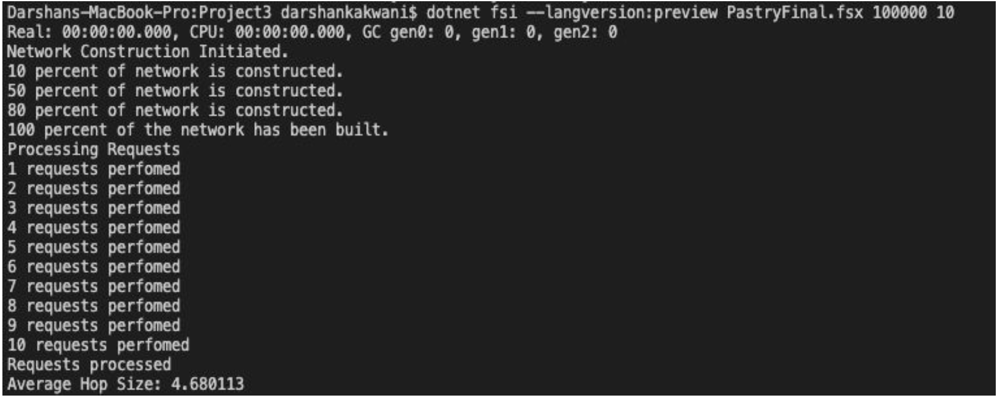

# Pastry-Protocol

This code implements the Pastry Algorithm as described in the paper: http://rowstron.azurewebsites.net/PAST/pastry.pdf .

The project first constructs the network along with the routing tables for the given input and then starts performing requests from each node.

## How to Run

Run the code using the following command
```bash
dotnet fsi --langversion:preview Pastry.fsx arg1 arg2
```
where arg1 = number of nodes, arg2 = number of requests

## Output

The output will look like the following:

It will first indicate how much of the network has been built.
Then it starts sending out requests from each node n number of times
At the end of the execution, the average number of hops is printed.

Example:


## Largest Network

Number of nodes: 100000
Number of requests: 10
